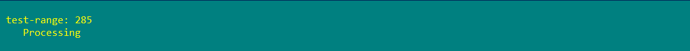

# Examples

## [Write-ProgressEx.pipe.ps1](Write-ProgressEx.pipe.ps1)

## [Write-ProgressEx.parm.ps1](Write-ProgressEx.parm.ps1)

## [Write-ProgressEx.info.ps1](Write-ProgressEx.info.ps1)

## [Write-ProgressEx.multi.ps1](Write-ProgressEx.multi.ps1)

## [Write-ProgressEx.counter.ps1](Write-ProgressEx.counter.ps1)

## [Write-ProgressEx.autoName.ps1](Write-ProgressEx.autoName.ps1)

The cmdlet use a script file name as an Activity...

or the cmdlet use a function name as an Activity...

