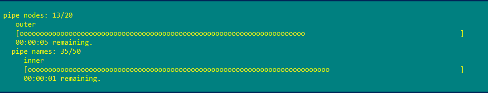
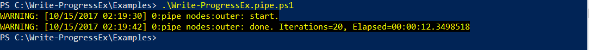

mazzy@mazzy.ru, 2017-11-06, [https://github.com/mazzy-ax/Write-ProgressEx](https://github.com/mazzy-ax/Write-ProgressEx)

  [](https://www.powershellgallery.com/packages/write-ProgressEx)

---

# Write-ProgressEx: extended write-progress cmdlet

**Write-ProgressEx** extend the functionality of the standard powershell cmdlet. Write-ProgressEx is a powershell native cmdlet that provide a simple way to show ProgressBars, PercentComplete and SecondsRemaining.


The cmdlet:

* works with pipe;
* works with empty activity string;
* uses [system.diagnostic.stopwatch] to calculate remaning seconds and dispaly a total elapsed time;
* completes all inner progresses if no parameters;
* automatically completes with pipe;
* automatically calculates percents;
* automatically displays current iteration and totals on progress bar;
* automatically set parent id for a inner loop;
* stores totals, current values and actual parameters into the module hashtable;
* provides get/set cmdlets to access actual parameters;
* show messages with date, time, iterations and elapsed time on events:
  * first iteration;
  * activity changed;
  * status changed;
  * completed.
* uses script blocks to show messages;
* provide counter functional. See [Write-ProgressEx as a counter](Examples/Write-ProgressEx.counter.ps1);
* use the caller function name or the caller script file name as the Activity.

Note 1: the cmdlet is not safe with multi-thread.

# Examples

A pipe and a simple loop:

```powershell
$range1 = 1..20
$range1 | Write-ProgressEx "loop 1" -Total $range1.Count -ShowMessages | ForEach-Object {
    # ....
}

$range2 = 1..15
$range2 | ForEach-Object {
    # ....
    Write-ProgressEx "loop 2" -Total $range2.Count -Increment
}

Write-ProgressEx #close all progress bars
```

Pipes in nested loops:

```powershell
$outer = 1..20
$inner = 1..50

$outer | Write-ProgressEx "pipe nodes" -Status "outer" -Total $outer.Count -ShowMessages | ForEach-Object {
    $inner | Write-ProgressEx "pipe names" -id 1 -Status "inner" -Total $inner.Count | ForEach-Object {
        # ....
    }
}
```





More samples are in the folder [Examples](Examples).

# Installation

Automatic install Write-ProgressEx module from the [PowerShell Gallery](https://www.powershellgallery.com/packages/write-ProgressEx):

```powershell
Install-Module -Name Write-ProgressEx
Import-Module Write-ProgressEx
```

Automatic install Write-ProgressEx module from the [NuGet.org](https://www.nuget.org/packages/Write-ProgressEx):

```powershell
Install-Package -Name Write-ProgressEx
Import-Module Write-ProgressEx
```

or manual:

* Download and unblock the latest .zip file.
* Extract the .zip into your $PSModulePath, e.g. ~\Documents\WindowsPowerShell\Modules.
* Ensure the extracted folder is named 'Write-ProgressEx'.
* Set an execution policy to RemoteSigned or Unrestricted to execute not signed modules 'Set-ExecutionPolicy RemoteSigned'.
* Run 'Import-Module Write-ProgressEx'.

# Changelog

See file [CHANGELOG.md](CHANGELOG.md).